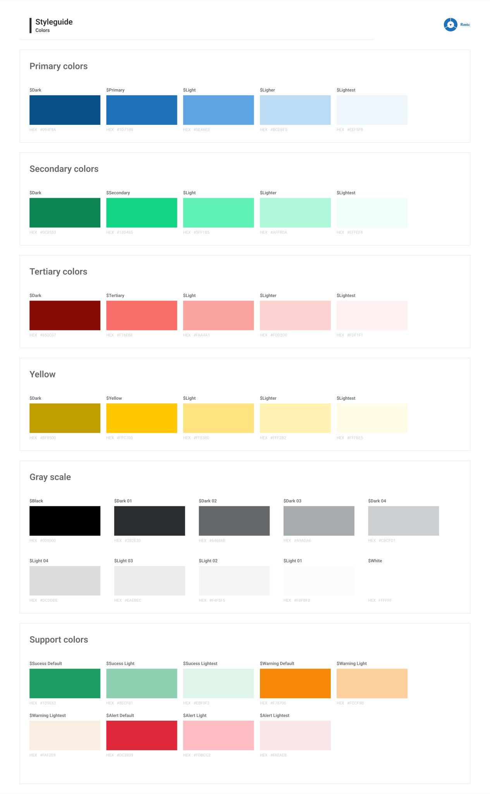
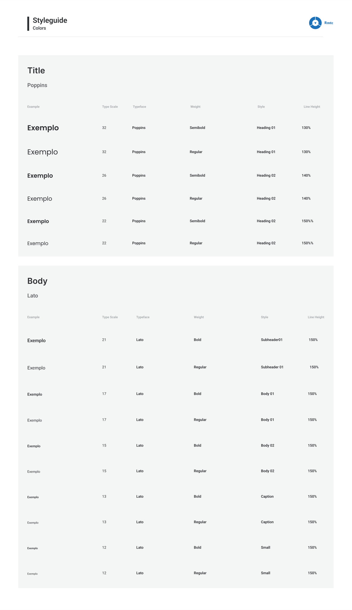
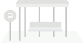
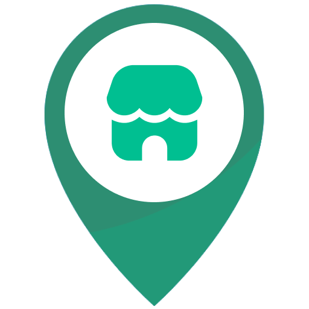

# Guia de Configuração do Aplicativo SAM - White Label

---

## Índice

1. [Paleta de Cores](#paleta-de-cores)
2. [Tipografia](#tipografia)
3. [Telas Customizáveis](#telas-customizáveis)
   - [Splash Screen](#splash-screen)
   - [Onboarding Screens](#onboarding-screens)
4. [Imagens Personalizáveis](#imagens-personalizáveis)
5. [Marcadores de Mapas](#marcadores-de-mapas)
6. [Animações](#animações)
7. [Templates Email](#templates-email)

---

## Paleta de Cores



| Color Name | Code |
| :-------------------------------------- | -----------------------: |  
|  colorHeader | 0xFF1D71B8 |
|  colorHeaderDark |  0xFF094F8A | 
|  colorPrimaryDark |  0xFF094F8A | 
|  colorPrimary |  0xFF1D71B8 | 
|  colorPrimaryLight |  0xFF5EA6E3 | 
|  colorPrimaryLighter |  0xFFBCDBF5 | 
|  colorPrimaryLightest |  0xFFEEF5FB | 
|  colorSecondaryDark |  0xFF0C8553 | 
|  colorSecondary |  0xFF13D485 | 
|  colorSecondaryLight |  0xFF5FF1B5 | 
|  colorSecondaryLighter |  0xFFAFF8DA | 
|  colorSecondaryLightest |  0xFFEFFEF8 | 
|  colorTertiaryDark |  0xFF850C07 | 
|  colorTertiary |  0xFFF76E68 | 
|  colorTertiaryLight |  0xFFFAA4A1 | 
|  colorTertiaryLighter |  0xFFFDD2D0 | 
|  colorTertiaryLightest |  0xFFFDF1F1 | 
|  colorBlack |  0xFF000000 | 
|  colorDark1 |  0xFF2B2E30 | 
|  colorDark2 |  0xFF64686B | 
|  colorDark3 |  0xFFA9ADA6 | 
|  colorDark4 |  0xFFCBCFD1 | 
|  colorLight4 |  0xFFDCDDDE | 
|  colorLight3 |  0xFFEAEBEC | 
|  colorLight2 |  0xFFF4F5F5 | 
|  colorLight1 |  0xFFFBFBFB | 
|  colorWhite |  0xFFFFFFFF | 
|  colorSuccess |  0xFF1D9E62 | 
|  colorSuccessLight |  0xFF8ECFB1 | 
|  colorSuccessLightest |  0xFFEBF9F2 | 
|  colorWarning |  0xFFF78706 | 
|  colorWarningLight |  0xFFFCCF9B | 
|  colorWarningLightest |  0xFFFAF2E9 | 
|  colorError |  0xFFDC2839 | 
|  colorErrorLight |  0xFFFDBCC2 | 
|  colorErrorLightest |  0xFFFAEAEB |

---
## Tipografia



> A aplicação de fontes com espaçamentos diferentes e/ou escalas diferentes pode causar o mal funcionamento de partes do aplicativo. 

---

## Telas Customizáveis

### Splash Screen

Tela apresentada quando o aplicativo é iniciado. Tem como objetivo proporcionar uma experiência mais agradável enquanto o aplicativo realiza tarefas de inicialização. Ajuda a reforçar a identidade da marca. Tela 100% customizável, inclusive com a possibilidade de rodar animações lottie. 
`(Conforme especificado em Animações)`

### Onboarding Screens

Conjunto de telas que são apresentadas ao usuário no primeiro uso do aplicativo. Seu objetivo é orientar os usuários e destacar as principais funcionalidades. ```* Recomenda-se o uso de no máximo 3 telas de onboarding.```

Essas telas são compostas por 4 elementos customizáveis:

<br>
<u> 1. Background Image </u>


```
! Este background é compartilhado por todas as telas de Onboarding.
- Dimensões: 390x296 pixels
- Formato: PNG
```

<br>
<u> 2. Onboarding Image </u>


```
- Dimensões: 328x207 pixels
- Formato: PNG
```

<br><br>
<u> 3. Título Descritivo </u> <br><br>
   Este texto deve ser um título para a funcionalidade.

   > Tipografia utilizada: Title.Heading02.Semibold

<br>
<u> 4. Descrição </u> <br><br> 

Aqui deve ser feita uma descrição sucinta da funcionalidade.

> Tipografia utilizada: Text.Body01.Regular

---

## Imagens Customizáveis

<u> 1. Boas Vindas </u>


```
- Formato: SVG
```

<u> 2. Mobile Ticketing </u>


```
- Formato: PNG com fundo transparente
- Uso: Tela que mostra que a funcionalidade de mobile ticketing estará disponível em breve.
```


<u> 3. Account-based Ticketing </u>


```
- Formato: PNG com fundo transparente
- Uso: Tela que mostra que a funcionalidade de ABT estará disponível em breve.
```

<u> 4. Permissão de Uso da Localização </u>


```
- Formato: PNG com fundo transparente
- Uso: Tela de solicitação de permissão para uso da localização.
```

<u> 5. Permissão de Envio de Notificações </u>


```
- Formato: PNG com fundo transparente
- Uso: Tela de solicitação de permissão para envio de notificações.
```

<u> 6. Logo do Assistente Virtual </u>


```
- Formato: PNG com fundo transparente
- Uso: Tela de chat com o assistente virtual.
```

<u> 7. Lista Vazia de Cartões de Transporte </u>


```
- Formato: PNG com fundo transparente
- Uso: Imagem que é mostrada quando o usuário não tem nenhum cartão adicionado.
```

<u> 8. Nenhum Ponto de Parada Favoritado </u>



```
- Formato: PNG com fundo transparente
- Uso: Tela de solicitação de permissão para envio de notificações.
```


## Marcadores de Mapas

<u> 1. Ônibus </u>


```
- Dimensões: 48x48 pixels
- Formato: PNG 
```

<u> 2. Ponto de Parada </u>


```
- Dimensões: 48x48 pixels
- Formato: PNG
```

<u> 3. Ponto de Parada Favoritado </u>


```
- Dimensões: 48x48 pixels
- Formato: PNG
```

<u> 4. Localização do Usuário </u>


```
- Dimensões: 48x48 pixels
- Formato: PNG
```

<u> 5. Ponto de Venda/Recarga </u>



```
- Dimensões: 48x48 pixels
- Formato: PNG
```

---

## Animações

<u>1. Loading </u>

<!-- Incluindo a biblioteca lottie-web -->
<script src="https://cdnjs.cloudflare.com/ajax/libs/lottie-web/5.7.4/lottie.min.js"></script>

<!-- Contêiner para a animação Lottie -->
<div id="lottie-container" style="width: 300px; height: 300px;"></div>

<script>
  // Inicializando a animação Lottie
  lottie.loadAnimation({
    container: document.getElementById('lottie-container'), // ID do contêiner
    renderer: 'svg',
    loop: true,
    autoplay: true,
    path: 'assets/animations/loading_rmtc.json' // Caminho para o arquivo JSON da animação
  });
</script>

```
- Formato: JSON (Lottie)
- Uso: Sempre que há uma espera para carregamento ou processamento de alguma informação.
```


<u>2. Sucesso na Solicitação </u>

<!-- Incluindo a biblioteca lottie-web -->
<script src="https://cdnjs.cloudflare.com/ajax/libs/lottie-web/5.7.4/lottie.min.js"></script>

<!-- Contêiner para a animação Lottie -->
<div id="lottie-container2" style="width: 300px; height: 300px;"></div>

<script>
  // Inicializando a animação Lottie
  lottie.loadAnimation({
    container: document.getElementById('lottie-container2'), // ID do contêiner
    renderer: 'svg',
    loop: true,
    autoplay: true,
    path: 'assets/animations/step_completed.json' // Caminho para o arquivo JSON da animação
  });
</script>

```
- Formato: JSON (Lottie)
- Uso: Animação para casos de sucesso.
```

<u>3. Captura de Áudio </u>
<!-- Incluindo a biblioteca lottie-web -->
<script src="https://cdnjs.cloudflare.com/ajax/libs/lottie-web/5.7.4/lottie.min.js"></script>

<!-- Contêiner para a animação Lottie -->
<div id="lottie-container3" style="width: 300px; height: 300px;"></div>

<script>
  // Inicializando a animação Lottie
  lottie.loadAnimation({
    container: document.getElementById('lottie-container3'), // ID do contêiner
    renderer: 'svg',
    loop: true,
    autoplay: true,
    path: 'assets/animations/wave.json' // Caminho para o arquivo JSON da animação
  });
</script>

```
- Formato: JSON (Lottie)
- Uso: Captura de áudio por parte do assistente virtual
```
 
---

## Templates Email

<u>1. Email de Boas Vindas </u>


[Preview do HTML](assets/html/welcome.html)


<u>2. Esqueceu a sua senha</u>


[Preview do HTML](assets/html/forgotpassword.html)