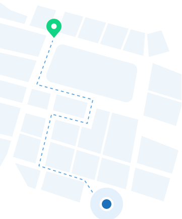
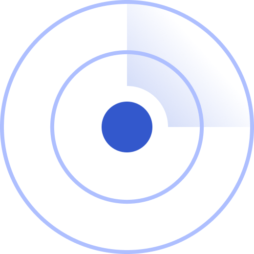

# Guia de Configuração do Aplicativo SAM - White Label

---

## Índice

1. [Paleta de Cores](#paleta-de-cores)
2. [Tipografia](#tipografia)
3. [Telas Customizáveis](#telas-customizáveis)
   - [Splash Screen](#splash-screen)
   - [Onboarding Screens](#onboarding-screens)
4. [Imagens Personalizáveis](#imagens-personalizáveis)
5. [Marcadores de Mapas](#marcadores-de-mapas)
6. [Animações](#animações)
7. [Templates Email](#templates-email)

---

## Paleta de Cores


| Color Name | Code |
| :-------------------------------------- | -----------------------: |  
|  colorHeader | 0xFF1D71B8 |
|  colorHeaderDark |  0xFF094F8A | 
|  colorPrimaryDark |  0xFF094F8A | 
|  colorPrimary |  0xFF1D71B8 | 
|  colorPrimaryLight |  0xFF5EA6E3 | 
|  colorPrimaryLighter |  0xFFBCDBF5 | 
|  colorPrimaryLightest |  0xFFEEF5FB | 
|  colorSecondaryDark |  0xFF0C8553 | 
|  colorSecondary |  0xFF13D485 | 
|  colorSecondaryLight |  0xFF5FF1B5 | 
|  colorSecondaryLighter |  0xFFAFF8DA | 
|  colorSecondaryLightest |  0xFFEFFEF8 | 
|  colorTertiaryDark |  0xFF850C07 | 
|  colorTertiary |  0xFFF76E68 | 
|  colorTertiaryLight |  0xFFFAA4A1 | 
|  colorTertiaryLighter |  0xFFFDD2D0 | 
|  colorTertiaryLightest |  0xFFFDF1F1 | 
|  colorBlack |  0xFF000000 | 
|  colorDark1 |  0xFF2B2E30 | 
|  colorDark2 |  0xFF64686B | 
|  colorDark3 |  0xFFA9ADA6 | 
|  colorDark4 |  0xFFCBCFD1 | 
|  colorLight4 |  0xFFDCDDDE | 
|  colorLight3 |  0xFFEAEBEC | 
|  colorLight2 |  0xFFF4F5F5 | 
|  colorLight1 |  0xFFFBFBFB | 
|  colorWhite |  0xFFFFFFFF | 
|  colorSuccess |  0xFF1D9E62 | 
|  colorSuccessLight |  0xFF8ECFB1 | 
|  colorSuccessLightest |  0xFFEBF9F2 | 
|  colorWarning |  0xFFF78706 | 
|  colorWarningLight |  0xFFFCCF9B | 
|  colorWarningLightest |  0xFFFAF2E9 | 
|  colorError |  0xFFDC2839 | 
|  colorErrorLight |  0xFFFDBCC2 | 
|  colorErrorLightest |  0xFFFAEAEB |

---
## Tipografia


> A aplicação de fontes com espaçamentos diferentes e/ou escalas diferentes pode causar o mal funcionamento de partes do aplicativo. 

---

## Telas Customizáveis

### Splash Screen

Tela apresentada quando o aplicativo é iniciado. Tem como objetivo proporcionar uma experiência mais agradável enquanto o aplicativo realiza tarefas de inicialização. Ajuda a reforçar a identidade da marca. Tela 100% customizável, inclusive com a possibilidade de rodar animações lottie. 
`(Conforme especificado em Animações)`

### Onboarding Screens

Conjunto de telas que são apresentadas ao usuário no primeiro uso do aplicativo. Seu objetivo é orientar os usuários e destacar as principais funcionalidades. ```* Recomenda-se o uso de no máximo 3 telas de onboarding.```

Essas telas são compostas por 4 elementos customizáveis:

<br>
<u> 1. Background Image </u>


```
! Este background é compartilhado por todas as telas de Onboarding.
- Dimensões: 390x296 pixels
- Formato: PNG
```

<br>
<u> 2. Onboarding Image </u>


```
- Dimensões: 328x207 pixels
- Formato: PNG
```

<br><br>
<u> 3. Título Descritivo </u> <br><br>
   Este texto deve ser um título para a funcionalidade.

   > Tipografia utilizada: Title.Heading02.Semibold

<br>
<u> 4. Descrição </u> <br><br> 

Aqui deve ser feita uma descrição sucinta da funcionalidade.

> Tipografia utilizada: Text.Body01.Regular

---

## Imagens Customizáveis

<u> 1. Boas Vindas </u>



```
- Formato: SVG
```

<u> 2. Mobile Ticketing </u>


```
- Formato: PNG com fundo transparente
- Uso: Tela que mostra que a funcionalidade de mobile ticketing estará disponível em breve.
```


<u> 3. Account-based Ticketing </u>


```
- Formato: PNG com fundo transparente
- Uso: Tela que mostra que a funcionalidade de ABT estará disponível em breve.
```

<u> 4. Permissão de Uso da Localização </u>



```
- Formato: PNG com fundo transparente
- Uso: Tela de solicitação de permissão para uso da localização.
```

<u> 5. Permissão de Envio de Notificações </u>


```
- Formato: PNG com fundo transparente
- Uso: Tela de solicitação de permissão para envio de notificações.
```

<u> 6. Logo do Assistente Virtual </u>


```
- Formato: PNG com fundo transparente
- Uso: Tela de chat com o assistente virtual.
```

<u> 7. Lista Vazia de Cartões de Transporte </u>


```
- Formato: PNG com fundo transparente
- Uso: Imagem que é mostrada quando o usuário não tem nenhum cartão adicionado.
```

<u> 8. Nenhum Ponto de Parada Favoritado </u>


```
- Formato: PNG com fundo transparente
- Uso: Tela de solicitação de permissão para envio de notificações.
```


## Marcadores de Mapas

<u> 1. Ônibus </u>


```
- Dimensões: 48x48 pixels
- Formato: PNG 
```

<u> 2. Ponto de Parada </u>


```
- Dimensões: 48x48 pixels
- Formato: PNG
```

<u> 3. Ponto de Parada Favoritado </u>


```
- Dimensões: 48x48 pixels
- Formato: PNG
```

<u> 4. Localização do Usuário </u>


```
- Dimensões: 48x48 pixels
- Formato: PNG
```

<u> 5. Ponto de Venda/Recarga </u>


```
- Dimensões: 48x48 pixels
- Formato: PNG
```

---

## Animações

<u>1. Loading </u>

<!-- Incluindo a biblioteca lottie-web -->
<script src="https://cdnjs.cloudflare.com/ajax/libs/lottie-web/5.7.4/lottie.min.js"></script>

<!-- Contêiner para a animação Lottie -->
<div id="lottie-container" style="width: 300px; height: 300px;"></div>

<script>
  // Inicializando a animação Lottie
  lottie.loadAnimation({
    container: document.getElementById('lottie-container'), // ID do contêiner
    renderer: 'svg',
    loop: true,
    autoplay: true,
    path: 'assets/animations/loading_rmtc.json' // Caminho para o arquivo JSON da animação
  });
</script>

```
- Formato: JSON (Lottie)
- Uso: Sempre que há uma espera para carregamento ou processamento de alguma informação.
```


<u>2. Sucesso na Solicitação </u>

<!-- Incluindo a biblioteca lottie-web -->
<script src="https://cdnjs.cloudflare.com/ajax/libs/lottie-web/5.7.4/lottie.min.js"></script>

<!-- Contêiner para a animação Lottie -->
<div id="lottie-container2" style="width: 300px; height: 300px;"></div>

<script>
  // Inicializando a animação Lottie
  lottie.loadAnimation({
    container: document.getElementById('lottie-container2'), // ID do contêiner
    renderer: 'svg',
    loop: true,
    autoplay: true,
    path: 'assets/animations/step_completed.json' // Caminho para o arquivo JSON da animação
  });
</script>

```
- Formato: JSON (Lottie)
- Uso: Animação para casos de sucesso.
```

<u>3. Captura de Áudio </u>
<!-- Incluindo a biblioteca lottie-web -->
<script src="https://cdnjs.cloudflare.com/ajax/libs/lottie-web/5.7.4/lottie.min.js"></script>

<!-- Contêiner para a animação Lottie -->
<div id="lottie-container3" style="width: 300px; height: 300px;"></div>

<script>
  // Inicializando a animação Lottie
  lottie.loadAnimation({
    container: document.getElementById('lottie-container3'), // ID do contêiner
    renderer: 'svg',
    loop: true,
    autoplay: true,
    path: 'assets/animations/wave.json' // Caminho para o arquivo JSON da animação
  });
</script>

```
- Formato: JSON (Lottie)
- Uso: Captura de áudio por parte do assistente virtual
```
 
---

## Templates Email

<u> Email de Boas Vindas </u>

<!DOCTYPE html>
<html lang="pt-br">

    <head>
        <meta charset="UTF-8">
        <meta http-equiv="X-UA-Compatible" content="IE=edge">
        <meta name="viewport" content="width=device-width, initial-scale=1.0">
        <title>Email Validation</title>
        <style type="text/css" rel="stylesheet" media="all">
            @import url('https://fonts.googleapis.com/css2?family=Inter:wght@300;400;500;600&display=swap');

            *,
            *:after,
            *:before {
                margin: 0;
                padding: 0;
                box-sizing: border-box;
                text-decoration: none;
                font-family: "Inter", Helvetica, Arial, sans-serif;
            }

            .hcenter {
                margin: 0 auto 0 auto;
            }

            .box {
                background: #F7F9FC;
                width: 40%;
                max-width: 600px;
                margin: 0 auto 0 auto;
            }

            @media only screen and (max-width: 768px) {
                .box {
                    width: 100%;
                }
            }

            .title {
                display: flex;
                background: #7272CF;
                width: 100%;
                height: 80px;
                padding: 0 20px;
            }

            .sub-title {
                padding: 30px 25px;
                margin-top: 20px;
            }

            .thanks {
                color: #343949;
                font-weight: 500;
                font-size: 18px;
                line-height: 22.5px;
                margin: 20px auto 0;
            }

            .confirm {
                color: #343949;
                font-weight: 500;
                font-size: 24px;
                line-height: 30px;
                margin: 0 auto 0;
            }

            .main {
                background: #FBFCFE;
                padding: 25px;
            }

            .hello {
                color: #343949;
                font-weight: 500;
                font-size: 24px;
                margin-bottom: 15px;
            }

            .forgot {
                color: #343949;
                font-weight: 500;
                font-size: 24px;
                line-height: 36px;
                margin-bottom: 40px;
            }

            .message {
                color: #343949;
                font-weight: 500;
                font-size: 18px;
                line-height: 27px;
                text-align: justify;
                margin-bottom: 30px;
            }

            .btn {
                display: block;
                color: #fff;
                background: #7675D3;
                border-radius: 7px;
                text-align: center;
                text-decoration: none;
                box-shadow: 0 2px 3px rgba(0, 0, 0, 0.16);
                padding: 15px;
                border: none;
                cursor: pointer;
                font-size: 16px;
                line-height: 16.56px;
                width: 270px;
                height: 48px;
                margin: 0 auto 40px auto;
            }

            .btn:hover {
                background: #6968bb;
            }

            .main-thanks {
                color: #343949;
                font-weight: 500;
                font-size: 18px;
                line-height: 27px;
                margin-bottom: 5px;
            }

            .sam {
                color: #72788D;
                font-weight: 300;
                font-size: 22px;
                line-height: 27px;
                margin-bottom: 30px;
            }

            .footer {
                padding: 25px;
            }

            .download-app {
                font-weight: 600;
                font-size: 16px;
                line-height: 26px;
                color: #343949;
                margin-top: 10px;
                margin-bottom: 10px;
            }

            .store {
                display: flex;
                margin-bottom: 10px;
            }

            .contact {
                color: #343949;
                font-weight: 600;
                font-size: 16px;
                line-height: 26px;
                text-align: center;
                margin-bottom: 10px;
            }

            .email {
                color: #343949;
                font-weight: 400;
                font-size: 10px;
                line-height: 24px;
                margin-bottom: 5px;
                text-decoration: none;
            }

            .email:hover {
                color: #72788D;
                text-decoration: underline;
                cursor: pointer;
            }

            .div-instagram {
                display: flex;
                margin: 0 0 25px 0;
                text-decoration: none;
            }

            .div-instagram p {
                font-weight: 400;
                font-size: 10px;
                color: #343949;
            }

            .div-instagram p:hover {
                text-decoration: underline;
            }

            .div-descadastro {
                display: flex;
            }

            .div-descadastro p {
                font-weight: 400;
                font-size: 10px;
                line-height: 24px;
                color: #72788D;
            }

            .div-descadastro a {
                font-weight: 400;
                font-size: 10px;
                line-height: 24px;
                color: #343949;
            }

            .div-descadastro a:hover {
                color: #72788D;
                text-decoration: underline;
                cursor: pointer;
            }
        </style>

    </head>

    <body style="width: 100% !important; height: 100%; background-color: #c4c7cd; overflow-y: auto; padding: 15px;">

        <div class="box">

            <div class="title">
                <a href="{{site_url}}" style="margin-top: auto; margin-bottom: auto;">
                    
                </a>
                <a href="{{instagram_url}}" style="margin-left: auto; margin-top: auto; margin-bottom: auto;">
                    
                </a>
            </div>

            <div class="sub-title">
                <p class="forgot">Esqueceu sua senha?</p>
                <center>
                    
                </center>
            </div>

            <div class="main">
                <p class="hello">Olá, {{name}}</p>
                <p class="message">Parece que você esqueceu sua senha de acesso ao SAM. Se isso for verdade, por favor, retorne ao aplicativo e insira
                    o código abaixo.</p>
                <p style="color: #343949; font-size: 36px; text-align: center; margin-bottom: 20px; font-weight: 600;">{{code}}</p>
                <hr style="margin: 15px 0 15px 0; border-top: 1px solid #E0E0E0;" />
                <p style="color: #72788D; margin: 15px 0 20px 0;">Se você não solicitou a alteração de senha, por favor, ignore este e-mail. Sua senha
                    não será alterada a menos que você solicite a redefinição da mesma.</p>
                <p class="main-thanks">Obrigado,</p>
                <p class="sam">Equipe SAM</p>
            </div>
            <div class="footer">
                <center>

                    <a href="{{site_url}}">
                        
                    </a>

                    <p class="download-app">Baixe o aplicativo</p>

                    <div class="store">
                        <a href="{{apple_store_url}}" style="margin-left: auto;">
                            
                        </a>

                        <a href="{{play_store_url}}" style="margin-right: auto;">
                            
                        </a>
                    </div>

                    <p class="contact">Contatos</p>
                    <a href="mailto:{{contact_email}}" class="email">{{contact_email}}</a>

                    <a href="{{instagram_url}}" class="div-instagram">
                        <p style="margin: auto 0 auto auto;">Instagram</p>
                        
                    </a>

                    <div class="div-descadastro">
                        <p style="margin-left: auto;">Não deseja receber mais nossos e-mails?</p>
                        <a href="#" style="margin: 0 auto 0 3px;">Descadastrar</a>
                    </div>
                </center>
            </div>
        </div>

    </body>

</html>